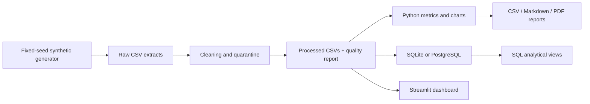

# Architecture

```mermaid
flowchart LR
 A[Fixed-seed synthetic generator] --> B[Raw CSV extracts]
 B --> C[Cleaning and quarantine]
 C --> D[Processed CSVs + quality report]
 D --> E[Python metrics and charts]
 D --> F[SQLite or PostgreSQL]
 D --> G[Streamlit dashboard]
 E --> H[CSV / Markdown / PDF reports]
 F --> I[SQL analytical views]
```

Data generation, cleaning, analysis, SQL loading, dashboard, reports and tests are separate modules.
